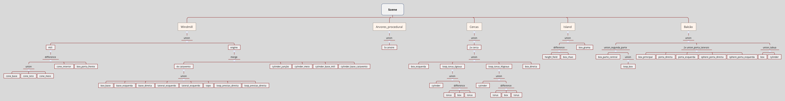

# feel_good_island
Trabalho da disciplina de Computação Gráfica

O trabalho feito em [POV-Ray](https://github.com/POV-Ray/povray) 3.7 e possui:
- 20+ [Operações CSG](http://www.povray.org/documentation/view/3.6.0/28/)
 - 18+ Unions
 - 1 Merge
 - 6+ Difference
- 40+ [Objetos CSG](http://www.povray.org/documentation/view/3.6.0/27/)
 - Box
 - Sphere
 - Cylinder
 - Torus
 - Height_field ([mount2.tga](mount2.tga) é a Height map)
- 12 Cameras na cena principal
- 1 Grid (linha azul indica eixo Z, vermelho indica eixo X)
- 5 [Árvores procedurais](http://www.oyonale.com/modeles.php?lang=en&page=1)
- 5 Fontes de luz + 1 Luz global

## CSG Tree

Para uma visualização rápida de como a cena principal está montada, veja a imagem [CSG_Tree.png](CSG_Tree.png) ou [CSG_Tree.svg](CSG_Tree.csv)

## Thanks

Made with [Atom](https://github.com/atom/atom) using:

- **save-commands**   
https://atom.io/packages/save-commands

- **atom-live-server**   
https://atom.io/packages/atom-live-server
